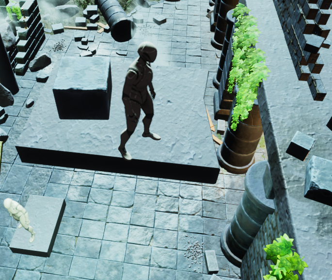
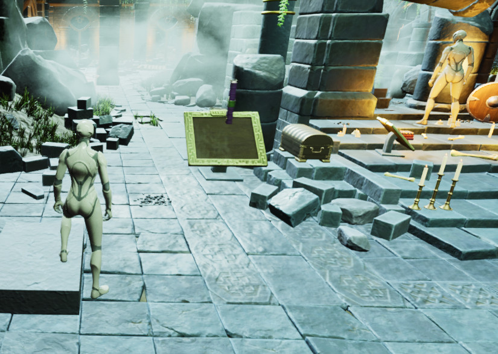

# SyncedMinds

A 3D 2-player co-op puzzle game built in Unreal Engine 5.6 with C++ and a custom TCP matchmaking backend.

## About

Players work together to activate pressure plates, ride moving platforms, and collect items to unlock the final area. All gameplay logic is server-authoritative with full replication.

## Features

- **Co-op Puzzles** — Pressure plates, moving platforms, collectables, and a gated win condition
- **Custom Matchmaking Backend** — C# TCP server with async client handling and protocol commands (`g`, `j`, `d`)
- **Dedicated Server Architecture** — Headless listen-server using `-server -nullrhi` flags
- **Server-Authoritative Replication** — All game state validated and replicated from server

## Tech Stack

- Unreal Engine 5.6 (C++)
- C# (.NET) for matchmaking server
- TCP sockets for client-server communication

## Architecture

| Pattern | Usage |
|---------|-------|
| Observer | PressurePlate broadcasts via delegates; Transporter subscribes and reacts |
| Singleton | GameInstance persists across levels, handles matchmaking |
| Component | Transporter is a reusable ActorComponent for any movable actor |
| State | Collectables and plates track state, change behavior accordingly |

## Running the Project

**Matchmaking Server:**
cd MatchmakingServer
dotnet run

**Game Server:**

SyncedMinds.exe /Game/The_Lost_Ruins/Levels/The_Lost_Ruins?listen -server -log -nullrhi -port=7777

**Client:**
Launch `SyncedMinds.exe`, click "Join Game" in the main menu.

## Known Limitations

- Client-side physics interactions (pushing objects) don't replicate to server — would require Server RPC implementation
- Uses headless listen-server instead of true dedicated server build (Epic Launcher UE limitation)

## Screenshots

<table>
  <tr>
    <td align="center" width="50%"><b>Player 1 steps on pressure plate and activates platform to carry Player 2 up</b></td>
    <td align="center" width="50%">Player 1 steps on pressure plate and opens altar passageway for Player 2 to cross<b></b></td>
  </tr>
  <tr>
    <td align="center"></td>
    <td align="center"></td>
  </tr>
</table>

## License

This project was developed for academic purposes.
